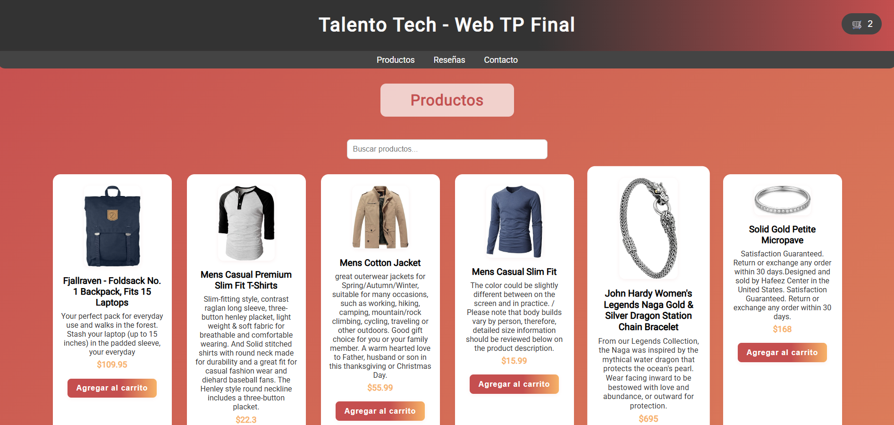

# Talento Tech - TP Final Web

**Autor:** Mauricio Daniel Olivera

## Descripción

Proyecto final para Talento Tech Front-end. Incluye una tienda online con productos dinámicos, carrito de compras, reseñas y formulario de contacto. Se aplican buenas prácticas de HTML, CSS, JavaScript, SEO y accesibilidad.

---

## Funcionalidades principales

### 1. Estructura Semántica y SEO

- Uso de etiquetas semánticas: `header`, `nav`, `main`, `section`, `footer`.
- Metaetiquetas para SEO: `description`, `keywords`, `author`, `viewport`, `charset`.
- Título descriptivo y optimizado.

### 2. JavaScript (`script.js`)

- Toda la interactividad se maneja en [`assets/js/script.js`](assets/js/script.js).
- Enlazado correctamente en el HTML.
- Manipulación del DOM para actualizar el carrito, mostrar productos, reseñas y mensajes al usuario.
- Validación de campos requeridos y formato de correo en el formulario de contacto.
- Uso de `fetch` para consumir datos de la [Fake Store API](https://fakestoreapi.com/) y mostrar productos en tarjetas.
- Visualización atractiva de productos: imagen, título, descripción y precio.

### 3. Carrito de compras dinámico

- Botón de carrito siempre visible en el header, con contador dinámico.
- Modal accesible para visualizar, editar cantidades y eliminar productos del carrito.
- Botón para vaciar el carrito.
- Estado del carrito persistente usando `localStorage`.
- Total de la compra actualizado en tiempo real.
- Diseño responsive y moderno.

### 4. Edición y visualización del carrito

- Lista de productos añadidos al carrito, mostrando cantidad, precio y total.
- Edición de cantidades y eliminación de productos desde el modal.
- Total dinámico que se actualiza automáticamente.

### 5. Productos y búsqueda

- Productos obtenidos dinámicamente desde la API REST con `fetch`.
- Cards de productos con imagen, descripción, precio y botón "Agregar al carrito".
- Barra de búsqueda que filtra productos en tiempo real.
- Estilos modernos y responsivos con Flexbox.

### 6. Reseñas

- Reseñas cargadas dinámicamente desde [`assets/data/data.json`](assets/data/data.json).
- Distribución en grid responsivo.

### 7. Formulario de contacto

- Formulario funcional con validación de campos requeridos y formato de correo.
- Envío de datos mediante [Formspree](https://formspree.io/).
- Accesibilidad: etiquetas asociadas correctamente, foco visible.

### 8. Accesibilidad

- Imágenes con atributo `alt`.
- Navegación por teclado asegurada (foco visible en botones y enlaces).
- Modal con roles y atributos ARIA (`role="dialog"`, `aria-modal="true"`, `aria-labelledby`).
- Botones con `aria-label` descriptivos.

### 9. Estilos y Responsividad

- Estilos principales en [`assets/css/styles.css`](assets/css/styles.css).
- Diseño moderno con gradientes, bordes redondeados y sombras.
- Adaptación a dispositivos móviles con media queries.
- Navegación y carrito sticky en la parte superior.

---

## Cómo probar

1. Clona o descarga el repositorio.
2. Abre [`index.html`](index.html) en tu navegador.
3. Explora las secciones de productos, reseñas y contacto.
4. Prueba el carrito agregando, editando y eliminando productos.
5. Prueba el formulario de contacto (usa datos de prueba).

## Archivos principales

- [`index.html`](index.html): Estructura principal de la página.
- [`assets/css/styles.css`](assets/css/styles.css): Estilos modernos y responsivos.
- [`assets/js/script.js`](assets/js/script.js): Lógica de productos, carrito y reseñas.
- [`assets/data/data.json`](assets/data/data.json): Datos de ejemplo para reseñas.
- [`assets/multimedia/`](assets/multimedia/): Imágenes y favicon.

---

**Este proyecto cumple con la consigna de la pre-entrega obligatoria de Talento Tech Front-end, incluyendo buenas prácticas de JavaScript, accesibilidad